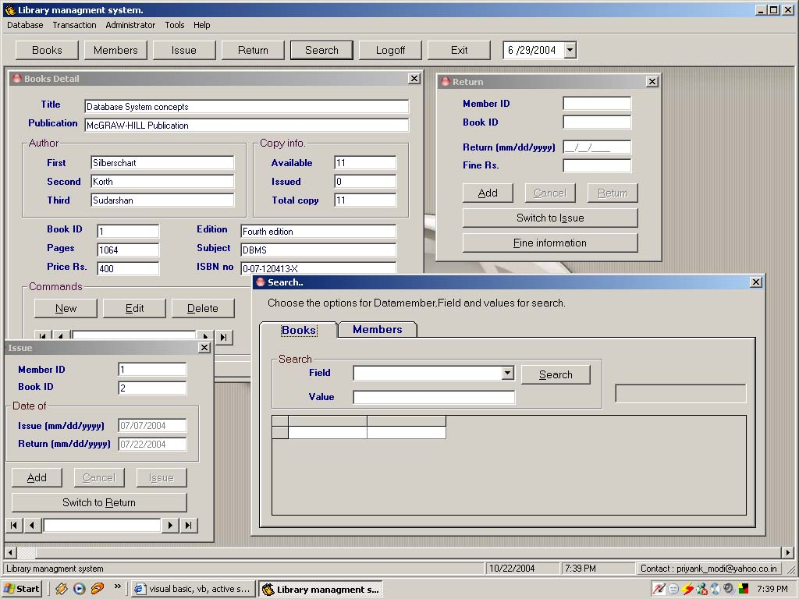



## Library managment system

### Description

For handling books,members and all library related stuff for library managment system
 
### More Info
 

             |
---                |---
**Submitted On**   |2004-10-22 19:32:22
**By**             |[Priyank Modi](https://github.com/Planet-Source-Code/PSCIndex/blob/master/ByAuthor/priyank-modi.md)
**Level**          |Beginner
**User Rating**    |4.5 (18 globes from 4 users)
**Compatibility**  |VB 6\.0
**Category**       |[Databases/ Data Access/ DAO/ ADO](https://github.com/Planet-Source-Code/PSCIndex/blob/master/ByCategory/databases-data-access-dao-ado__1-6.md)
**World**          |[Visual Basic](https://github.com/Planet-Source-Code/PSCIndex/blob/master/ByWorld/visual-basic.md)
**Archive File**   |[Library\_ma18092510232004\.zip](https://github.com/Planet-Source-Code/priyank-modi-library-managment-system__1-56883/archive/master.zip)

